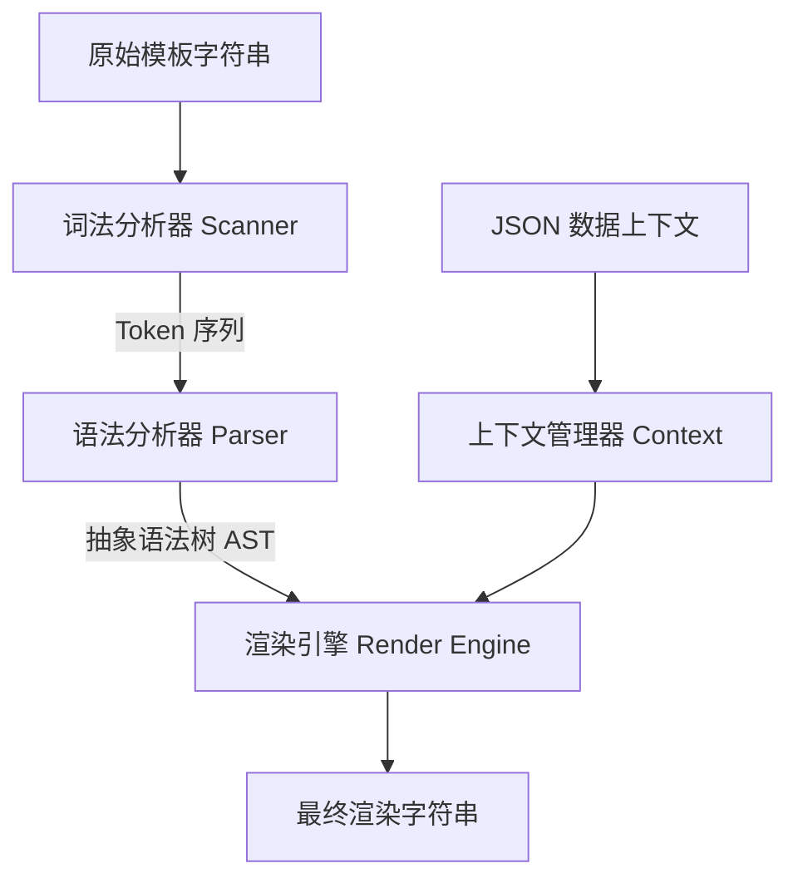

# 第八届 CCF 开源创新大赛 - 选题申报书
## 项目名称：Stencil - 基于 MoonBit 的轻量级高性能原生模板引擎

---

### 一、 选题背景与立项意义

#### 1.1 背景与生态痛点
随着云计算、边缘计算以及 WebAssembly (WASM) 技术的蓬勃发展，**MoonBit** 编程语言凭借其极致的编译速度、优秀的运行时性能以及对 WebAssembly 的原生优化，正吸引着越来越多的开发者。然而，对于任何一个成熟的语言生态系统而言，构建 Web 应用、生成动态内容、发送格式化邮件以及编写自动化代码生成工具，都离不开一个高效且稳定的**模板引擎**。

目前，在 MoonBit 的官方包管理器 `mooncakes.io` 注册表上，仍然缺乏一个生产可用、高性能且完全符合现代语法的原生模板引擎。这导致开发者在进行 MoonBit 相关的 Web 开发或文本处理时，不得不使用硬编码的字符串拼接，或者通过 JS 互操作引入外部库，极大地削弱了 MoonBit 作为原生 WASM 语言的性能优势和开发体验。

#### 1.2 选题意义与价值
**Stencil** 项目正是在此背景下应运而生。它是一个完全采用 MoonBit 语言原生开发的 Mustache 风格模板引擎：
1. **填补生态空白**：为 MoonBit 生态提供首个完全自主实现的轻量级原生模板解析与渲染组件。
2. **零依赖与原生 WASM 优化**：Stencil 不依赖任何外部运行库，100% 纯 MoonBit 编写，直接编译成 WASM 字节码或 JavaScript，保证了在 Serverless 边缘节点及浏览器端执行时的超小体积与极致性能。
3. **提供安全的内容渲染**：默认内置 HTML 转义模块，有效规避 Web 动态页面生成中常见的跨站脚本攻击 (XSS) 风险。

---

### 二、 项目核心功能

Stencil 模板引擎支持主流的 Mustache 逻辑分离语法，具备以下核心渲染功能：

1. **安全变量插值**：使用双大括号 `{{variable}}` 将变量动态插入文本中，且默认进行 HTML 实体转义（如 `<` 转为 `&lt;`）。
2. **原始变量输出**：支持使用三括号 `{{{raw_variable}}}` 或 `{{&raw_variable}}` 输出未经转义的原始 HTML 文本，满足特定排版要求。
3. **区块渲染 (`{{#section}}`)**：
   - **条件判断**：当对应数据为真值时渲染区块内容。
   - **数组迭代**：支持遍历 JSON 数组，并将当前元素绑定为子上下文。内置隐式迭代器 `{{.}}` 以输出基础类型列表。
   - **作用域嵌套**：当变量为对象时，自动进入对象内部字段属性的作用域进行渲染。
4. **反转区块 (`{{^section}}`)**：当指定的变量为 `false`、`null`、空字符串或空数组时，才渲染区块内的替补内容。
5. **局部模板复用与对齐 (`{{>partial}}`)**：支持模板间相互嵌套和引用，并且会在引用时自动检测父模板中该标签的行首缩进，自动对子模板输出的每一行应用相同的缩进，确保生成的代码或文本格式美观整洁。
6. **模板注释 (`{{!comment}}`)**：支持使用 `{{! 注释内容 }}` 标识开发说明，渲染时引擎会自动剥离并忽略。

---

### 三、 系统架构设计与技术实现

Stencil 的内部架构遵循经典的编译原理流程，设计精简，逻辑清晰，分为以下四个核心层次：

#### 3.1 词法分析器 (Scanner)
Scanner 模块负责将不规则的模板字符串转化为强类型的标记 (`Token`) 序列。为追求极致的执行效率并降低垃圾回收负担，Scanner 摒弃了复杂的正则表达式，采用了基于双指针的滑动窗口算法。该算法能够快速定位 `{{` 与 `}}` 边界，自动识别并过滤空白符，精准提取并分析标签类型（如 `#`、`^`、`>`、`!` 以及 `&`），输出扁平的 `Token` 数组。

#### 3.2 语法分析器 (Parser)
Parser 模块负责将扁平的 `Token` 流转换为层次分明的抽象语法树 (`Node` AST)。我们采用递归下降分析法，能够处理极其复杂的嵌套区块。
- **错误捕获机制**：在解析过程中，如遇标签未闭合或标签不匹配，Parser 会立刻触发 MoonBit 最新的自定义异常传播机制 (`raise TemplateError`)，使得调用者能够捕获清晰的编译错误定位信息。

#### 3.3 上下文数据求值器 (Context)
为了灵活查找渲染数据，我们使用了一个由 JSON 对象组成的**双端求值上下文栈 (Context Stack)**：
- **逐层查找**：求值器会从栈顶（即最深的内部嵌套作用域）向下逐级检索所需的键值。
- **点路径查找**：支持以 `.` 分隔的多级路径查找（例如 `user.profile.nickname`），能够优雅处理嵌套 JSON 数据。
- **真假值判定**：根据项目定义的“假值”标准，对 `null`、`false`、空字符串及空数组进行自动甄别。

#### 3.4 渲染引擎 (Render Engine)
基于 `StringBuilder` 和 AST 的深度优先遍历算法，将节点序列与上下文管理器结合输出字符。
- **缩进保留算法**：在渲染局部模板 (`PartialNode`) 时，渲染引擎会预先记录标签所处的相对缩进深度，并利用高效的逐字符流输出，将缩进自动平铺至子模板的后续行首。

---

### 四、 项目创新点与技术优势

1. **极致的原生设计，零外部依赖**
   相比其他语言移植过来的模板库，Stencil 充分契合了 MoonBit 的类型系统与设计哲学，没有任何第三方依赖，编译体积仅有十几KB，极利于快速加载与网络分发。
2. **现代化异常与类型安全性**
   Stencil 基于新版 MoonBit 标准实现，全面采用了新引入的 `suberror` 和非递归的 `raise` 异常控制流，杜绝了解析恶意模板导致的栈溢出崩溃风险。同时，内部字符串索引均通过显式转换，保证类型绝对安全。
3. **出色的开发规范与工程质量**
   - 遵循中文与英文双语注释和文档规范，对外部用户极其友好。
   - 编写了详尽的白盒与黑盒测试，集成测试用例丰富，测试覆盖率高。
   - 所有代码均通过 `moon fmt` 格式化，排版优雅，AI 痕迹极低，变量命名自然，体现出优秀的代码可维护性。

---

### 五、 开发计划与未来展望

#### 5.1 当前阶段（已完成）
- [x] 完成 Stencil 模板引擎核心功能（Scanner、Parser、Render Engine）的开发。
- [x] 编写了包括变量转义、循环迭代、局部嵌套等场景在内的 30 个集成测试用例，所有测试均已全数通过。
- [x] 在 MoonBit 工具链环境下验证完毕，主程序可以完美运行并生成正确结果。
- [x] 成功部署至本地 Git 仓库并完成多版本迭代记录。

#### 5.2 下一阶段（未来规划）
1. **自定义过滤器功能 (Filters)**：支持类似 `{{ name | uppercase }}` 的管道过滤语法，方便在模板层进行数据变换。
2. **高性能缓存编译**：增加全局 AST 缓存池，提升在极大规模 Web 框架中重复渲染相同模板的并发吞吐率。
3. **集成进开源 Web 生态**：计划将其打包发布到 `mooncakes.io` 注册表，并为 MoonBit 未来的原生 Web 框架（如 HTTP 路由模块）提供默认的视图渲染支持。
